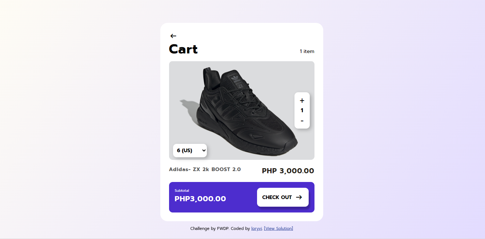

# Filipino Web Development Peer - Checkout Card Component Solution

This is a solution to the HTML/CSS/JS Challenge of FWDP.

## Table of contents

- [Overview](#overview)
  - [Screenshot](#screenshot)
  - [Links](#links)
- [My process](#my-process)
  - [Built with](#built-with)
  - [What I learned](#what-i-learned)
  - [Continued development](#continued-development)
  - [Useful resources](#useful-resources)
- [Author](#author)

## Overview

A component of a Checkout Card Component, found the UI from Figma Community by Softwareseni and Wirak S. [https://www.figma.com/community/file/1158585574208802327/checkout-page](https://www.figma.com/community/file/1158585574208802327/checkout-page)

### Screenshot

### Links

- Solution URL: [https://github.com/loryvi/order-form-component](https://github.com/loryvi/order-form-component)
- Live Site URL: [https://loryvi.github.io/order-form-component/](https://loryvi.github.io/order-form-component/)

## My process

### Built with

- Semantic HTML5 markup
- CSS custom properties
- Javascript

### What I learned

- Dropdown
- Buttons with javascript
- Gradient div

### Continued development

:bulb: Animation for the Checkout Button
:bulb: Add more product items using API
:bulb: Responsive Mobile Page
:bulb: Make it a reusable component!

### Useful resources

- [https://cssgradient.io/](https://cssgradient.io/) - Guide for CSS Gradient boxes
- [https://fonts.google.com/icons](https://fonts.google.com/icons) - easy to use, import and has a developer guide!
